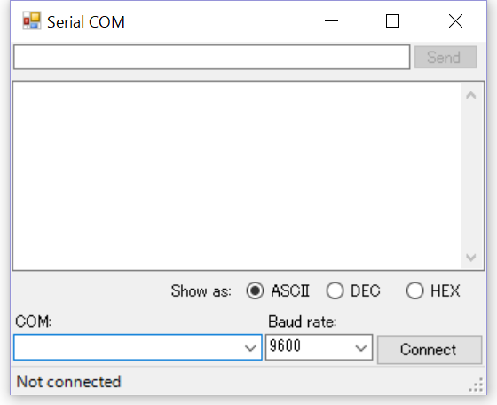

# serial COM test tool for Windows

Using this tool, you can send and receive via serial COM port.
This software is developed as a Windows Form Application using Visual Studio 2015, written in C#.

このツールはArduino IDEのシリアルモニタとほぼ同等の機能を実現するWindows用のソフトウェアです。
Visual Studio2015を用いて開発されたWindowsフォームアプリケーションであり、C#で記述されています。

Arduino IDEのシリアルモニタには無い機能として、ラジオボタンで受信したデータの表示形式を変更することができます

+ ASCII: 文字列として表示します
+ DEC: 10進数の値として表示します
+ HEX: 16進数の値として表示します

使ってみたいけどソースコードは要らねえ！と言う方は
「[win_serial-com_tool/SerialCOMform/bin/Release/](https://github.com/mashigure/win_serial-com_tool/tree/master/SerialCOMform/bin/Release)SerialCOMform.exe」をダウンロード下さい。

